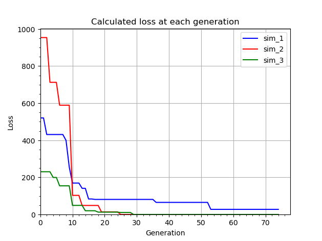

This is my implementation of the SADDLE algorithm described in https://doi.org/10.1038/s41467-022-29500-4. Briefly, this algorithm is used to choose a set of primers for a multiplex PCR. In order to use this program make sure that `numpy`, `pandas` and `matplotlib` are installed.<br>
You can try out the SADDLE algorithm with an example provided in the repo with `interactive_saddle.ipynb`.<br>
If you want to use your own data, then:<br>
1) Create a table with all of the primers that you are going to choose from (an example table is provided `Example_primer_sets.xlsx`). The table should look like this:<br>
| primer_for_1 | primer_rev_1 | primer_for_2 | primer_rev_2 | ... |
|:------------:|:------------:|:------------:|:------------:|:---:|
|AGTCGATACTGATT|AGCTCGTGCTGTTC|GATCTATGTACGTT|CGCTATATGCTAGT|...  |
|...           |   ...        |    ...       |   ...        | ... |
2) Load this table with pandas:
```python
import pandas as pd

all_primers = pd.read_excel("./your_file_name.xlsx")

```
3) Create an instance (or at least three instances since the algorithm higly depends on the initial set of primers, which is random) of `SaddleSimulator`, pass your table to it, set generation time (a breakpoint after which SADDLE algorithm will be switched to optimization), set length of a nucleotide substring to be searched (an integer number from 4 to 6), set a seed (it's not required but for reproducibility set it to any number you want). The code for the text above looks like this:
```python
from saddle import SaddleSimulator

sim_1 = SaddleSimulator(
    all_primers = all_primers, # Your table.
    gt = 100, # Generation time. Default value is 100.
    len_substring = 4, # Length of a nucleotide substring. Default is 4.
    seed = None # Default is None but I suggest to write a random number.
)

sim_2 = SaddleSimulator(
    all_primers = all_primers, # Your table.
    gt = 100, # Generation time. Default value is 100.
    len_substring = 4, # Length of a nucleotide substring. Default is 4.
    seed = None # Default is None but I suggest to write a random number.
)

sim_3 = SaddleSimulator(
    all_primers = all_primers, # Your table.
    gt = 100, # Generation time. Default value is 100.
    len_substring = 4, # Length of a nucleotide substring. Default is 4.
    seed = None # Default is None but I suggest to write a random number.
)
```
4) Then launch the SADDLE algorithm with the `.saddle()` method. The method returns the last (best) set of primers that was generated with the algorithm:
```python
last_set_of_primers_1 = sim_1.saddle()
last_set_of_primers_2 = sim_2.saddle()
last_set_of_primers_3 = sim_3.saddle()
```
5) When the method finishes it saves primer sets chosen at each generation and saves the loss calculated at each generation. To access all generated primer sets access property `.primer_variants` and to access loss use property `.loss_progress` (2D array: [generation, loss]). To ensure that the algorithm worked correctly (loss gradually decreases) view a plot of loss with the method `.plot_loss()`. You can pass matplotlib keyword arguments to modify the plot (for example add: `label = "sim_1", color = "blue"`).
```python
sim_1.plot_loss()
```
The plot should look similar to this:<br>
<br>
We can clearly see why it is required to launch SADDLE algorithm with different seeds and visualise how loss changed with generations. `sim_1` didn't find the best set of primers while `sim_2` and `sim_3` did. To create the image above the following code was used:
```python
import matplotlib.pyplot as plt

cm = 1 / 2.54 # To use cm instead of inches for figure size

fig, ax = plt.subplots(1, 1, figsize = (16 * cm, 12 * cm))

sim_1.plot_loss(label = "sim_1", color = "blue")
sim_2.plot_loss(label = "sim_2", color = "red")
sim_3.plot_loss(label = "sim_3", color = "green")

plt.grid()
plt.minorticks_on()
plt.xlim(xmin = 0)
plt.ylim(ymin = 0)
plt.legend()
plt.xlabel("Generation")
plt.ylabel("Loss")
plt.title("Calculated loss at each generation")
plt.show()
```